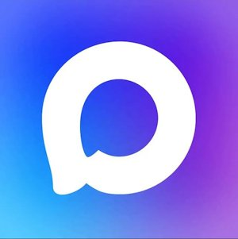

<p>

# MaxBot <a href="https://dev.max.ru/docs-api"></a>

</p>

<!-- <div align="center"> -->

[](https://yoomoney.ru/to/410019620244262)
[](https://script.google.com/)


<!-- </div> -->

Google Apps Script библиотека для работы с методами API MAX с поддержкой вебхуков, созданием медиафайлов, клавиатур.

## 📦 ID библиотеки

```
1dUzlK1qVuXOB8OOKgWazEBtCSbFRqIUv9F0-yQXM4K9xk6UlH-Ks2aOU
```

## 📋 Содержание

- [Установка](#установка)
- [Быстрый старт](#быстрый-старт)
- [Документация методов](#документация-методов)
- [Примеры](#примеры)
- [Документация](#документация)

## 🚀 Установка

### Способ 1: Использование библиотеки (Рекомендуется)

1. **Откройте [Google Apps Script](https://script.google.com/)**
2. **Создайте новый проект**
3. **Добавьте библиотеку MaxBot:**
   - В редакторе нажмите на значок `+` рядом с "Библиотеки"
   - Введите ID библиотеки
   - Выберите последнюю версию
   - Нажмите "Добавить"

### Способ 2: Полное копирование кода

1. **Создайте проект Apps Script**
2. **Добавьте файлы:**
   - Создайте файл `bot.gs` и скопируйте код из `bot/bot.js`
   - Создайте файл `builders.gs` и скопируйте код из `bot/builders.js`
   - Создайте файл `errors.gs` и скопируйте код из `bot/errors.js`
   - Создайте файл `types.gs` и скопируйте код из `bot/types.js`
   - Создайте файл `utils.gs` и скопируйте код из `bot/utils.js`

## ⚡ Быстрый старт

### Получение токена доступа

Инструкция, для получение токена на [dev.max.ru](https://dev.max.ru/docs/chatbots/bots-coding/prepare)

1. Создайте нового бота
2. Скопируйте токен доступа

### Простое использование

```javascript
// Импорт библиотеки (если используете как библиотеку)
const { Bot } = MaxBot;

// Создание экземпляра бота
const bot = new Bot("YOUR_ACCESS_TOKEN");

// Получение информации о боте
const botInfo = bot.getMe();
console.log("Информация о боте:", botInfo);

// Отправка сообщения
bot.sendMessage({
  text: "Привет, мир!",
  chatId: "CHAT_ID",
});
```

### С обработчиками событий

```javascript
class MyBot extends Bot {
  onMessage(message) {
    const chatId = message.recipient.data.chat_id;
    const text = message.body.text;

    if (text === "/start") {
      this.sendMessage({
        text: "Добро пожаловать!",
        chatId: chatId,
      });
    } else {
      this.sendMessage({
        text: `Вы написали: ${text}`,
        chatId: chatId,
      });
    }
  }

  onCallback(callback) {
    const chatId = callback.chat_id;
    const payload = callback.payload;

    this.sendMessage({
      text: `Нажата кнопка: ${payload}`,
      chatId: chatId,
    });
  }
}

const myBot = new MyBot("YOUR_ACCESS_TOKEN");
```

### Настройка веб-приложения

#### 1. Инициализация бота

```javascript
// Импорт библиотеки MaxBot
const { Bot } = MaxBot;

// Создание экземпляра бота
const bot = new Bot("YOUR_ACCESS_TOKEN");
```

#### 2. Создание кастомной версии бота

Создайте класс, наследующий от `Bot`, и переопределите нужные методы:

```javascript
class MyBot extends Bot {
  onMessage(message) {
    // Ваша логика обработки сообщений
    const chatId = message.recipient.data.chat_id;
    const text = message.body.text;

    // Пример обработки команды /start
    if (text === "/start") {
      this.sendMessage({
        text: "Добро пожаловать!",
        chatId: chatId,
      });
    }
  }

  onCallback(callback) {
    // Ваша логика обработки callback кнопок
    const chatId = callback.chat_id;
    const payload = callback.payload;

    this.sendMessage({
      text: `Нажата кнопка: ${payload}`,
      chatId: chatId,
    });
  }
}

// Создание экземпляра кастомного бота
const myBot = new MyBot("YOUR_ACCESS_TOKEN");
```

#### 3. Функция doPost для обработки вебхуков

```javascript
function doPost(e) {
  try {
    const data = JSON.parse(e.postData.contents);
    myBot.handleWebhook(data);
    return ContentService.createTextOutput(
      JSON.stringify({
        status: "success",
        message: "Webhook processed",
      })
    );
  } catch (error) {
    console.error("Ошибка обработки вебхука:", error);
    return ContentService.createTextOutput(
      JSON.stringify({
        status: "error",
        message: "Webhook processing failed",
        error: error.message,
      })
    );
  }
}
```

#### 4. Публикация веб-приложения

1. **Нажмите "Развернуть"** → **"Новое развертывание"**
2. **Выберите тип**: "Веб-приложение"
3. **Настройте доступ**:
   - Выполнение: "От моего имени"
   - Доступ: "Все пользователи"
4. **Нажмите "Развернуть"**
5. **Скопируйте URL веб-приложения**

#### 5. Установка вебхука

```javascript
// Замените YOUR_SCRIPT_ID на ID вашего скрипта
const webhookUrl = "https://script.google.com/macros/s/YOUR_SCRIPT_ID/exec";

// Установка вебхука
bot.setWebhook(webhookUrl);

// Проверка установки
const webhooks = bot.getWebhooks();
console.log("Установленные вебхуки:", webhooks);

// Удаление вебхука (если нужно)
bot.deleteWebhook();
```

## 📚 Документация методов

Полная документация всех доступных методов, билдеров и утилит находится в файле **[metods.md](src/metods.md)**.

Включает в себя:

- 🔧 API методы (бот, чаты, участники, сообщения, вебхуки, файлы)
- 🛠️ Билдеры (клавиатуры, медиа, команды)
- ❌ Обработка ошибок
- 🔧 Утилиты
- 📖 Дополнительная информация

## 📚 Примеры

### Полные примеры использования

Смотрите папку `examples/` для подробных примеров:

- `bot.js` - Основной пример бота
- `media.js` - Работа с медиафайлами
- `keyboard.js` - Создание клавиатур
- `command.js` - Обработка команд
- `error-handling.js` - Обработка ошибок

### Отправка сообщений

```javascript
// Простое сообщение
bot.sendMessage({
  text: "Привет!",
  chatId: "CHAT_ID",
});

// Сообщение с форматированием
bot.sendMessage({
  text: "**Жирный текст**",
  chatId: "CHAT_ID",
  format: "markdown",
});

// Сообщение с клавиатурой
const keyboard = bot.keyboard
  .callback("Кнопка 1", "btn1")
  .callback("Кнопка 2", "btn2")
  .build();

bot.sendMessage({
  text: "Выберите:",
  chatId: "CHAT_ID",
  keyboard,
});
```

### Отправка медиафайлов

```javascript
// Фото
const photo = bot.photo
  .url("https://example.com/photo.jpg")
  .caption("Красивое фото!")
  .build();

bot.sendMessage({
  text: photo.caption,
  chatId: "CHAT_ID",
  photo: photo.photo,
});

// Видео
const video = bot.video
  .url("https://example.com/video.mp4")
  .caption("Интересное видео")
  .build();

bot.sendMessage({
  text: video.caption,
  chatId: "CHAT_ID",
  video: video.video,
});

// Аудио
bot.sendMessage({
  text: "Музыка",
  chatId: "CHAT_ID",
  audio: "https://example.com/audio.mp3",
  title: "Название песни",
  performer: "Исполнитель",
});

// Файл
bot.sendMessage({
  text: "Документ",
  chatId: "CHAT_ID",
  file: "https://example.com/document.pdf",
});

// Местоположение
bot.sendMessage({
  text: "Местоположение",
  chatId: "CHAT_ID",
  latitude: 55.7558,
  longitude: 37.6176,
  title: "Москва",
  address: "Красная площадь",
});

// Контакт
bot.sendMessage({
  text: "Контакт",
  chatId: "CHAT_ID",
  phone_number: "+79001234567",
  first_name: "Иван",
  last_name: "Иванов",
});
```

## 📖 Документация

### Поддерживаемые форматы

- **Markdown**: `format: 'markdown'`
- **HTML**: `format: 'html'`

### Типы кнопок

- `callback` - Callback кнопка
- `link` - Ссылка
- `request_contact` - Запрос контакта
- `request_geo_location` - Запрос геолокации
- `open_app` - Открытие приложения
- `message` - Отправка сообщения

### Ограничения Apps Script

1. **Квоты выполнения**: 6 часов в день
2. **Время выполнения**: максимум 6 минут на запрос
3. **HTTP запросы**: максимум 20,000 в день
4. **Размер кода**: максимум 50 МБ

### Отладка

1. Откройте редактор Apps Script
2. Перейдите в "Выполнения"
3. Выберите функцию и нажмите "Просмотр выполнения"
4. Проверьте логи в консоли

## 📄 Лицензия

MIT License - см. файл [LICENSE](src/LICENSE) для подробностей.

## 🆘 Поддержка

Если у вас есть вопросы или проблемы:

1. Проверьте логи выполнения в Apps Script
2. Убедитесь, что токен правильный
3. Проверьте настройки веб-приложения
4. Обратитесь к документации API MAX: https://dev.max.ru/docs-api

---

**Примечание**: Этот проект не является официальным и не связан с MAX. Используйте на свой страх и риск.
